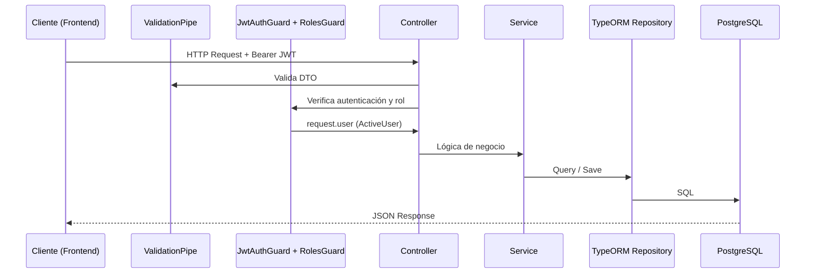
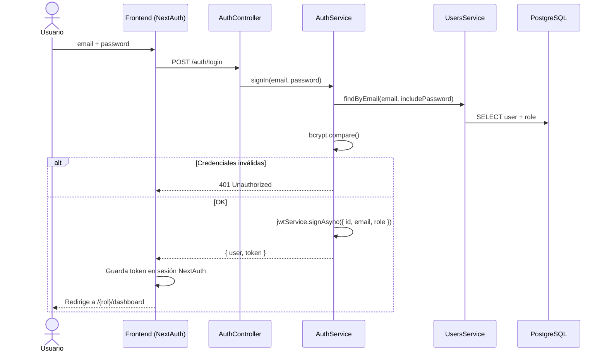
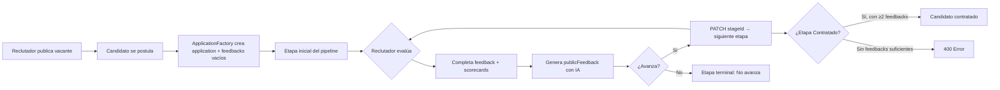

# Documentación Técnica — NextStep Backend (NestJS)

## 1. Arquitectura general

### 1.1 Visión del sistema

NextStep es una API REST desarrollada con **NestJS** y **TypeScript**. Gestiona procesos de selección laboral: publicación de vacantes, postulaciones, evaluación por etapas, feedback estructurado y generación de devoluciones con IA.

El código vive en `backend/src/`. El frontend (Next.js + NextAuth) consume esta API en `http://localhost:3001`; el backend expone Swagger en `/api-docs` (solo fuera de producción).

### 1.2 Estructura de módulos

La aplicación sigue la arquitectura modular de NestJS. Cada dominio de negocio es un **módulo** independiente registrado en `AppModule`:

```typescript
@Module({
  imports: [
    ConfigModule.forRoot({ isGlobal: true }),
    TypeOrmModule.forRoot({
      type: 'postgres',
      url: process.env.DATABASE_URL,
      ssl: true,
      autoLoadEntities: true,
      synchronize: false,
    }),
    UsersModule,
    FeedbackModule,
    AuthModule,
    JobOffersModule,
    JobApplicationsModule,
    RolesModule,
    StagesModule,
    SeniorityModule,
    AuditLogsModule,
    ScorecardsModule,
    CvModule,
    JwtModule,
  ],
})
export class AppModule {}
```

| Módulo | Responsabilidad |
|--------|-----------------|
| `AuthModule` | Login, registro, emisión de JWT |
| `UsersModule` | CRUD de usuarios |
| `RolesModule` | Roles del sistema (`admin`, `recruiter`, `applicant`) |
| `JobOffersModule` | Vacantes laborales |
| `JobApplicationsModule` | Postulaciones y pipeline de candidatos |
| `StagesModule` | Etapas del proceso de selección |
| `FeedbackModule` | Evaluaciones y generación de feedback con IA |
| `ScorecardsModule` | Puntajes por habilidad |
| `CvModule` | Subida y consulta de CVs |
| `SeniorityModule` | Niveles de seniority (Trainee, Junior, SemiSenior, Senior) |
| `AuditLogsModule` | Registro de auditoría |

### 1.3 Capas y organización interna

Cada módulo de feature sigue una estructura por capas:

```
módulo/
├── *.module.ts          → Registro de dependencias e imports
├── *.controller.ts      → Capa HTTP: rutas, guards, validación de entrada
├── *.service.ts         → Lógica de negocio
├── entities/            → Modelo de datos TypeORM (tablas PostgreSQL)
├── dto/                 → Objetos de transferencia con class-validator
├── guards/              → (solo Auth) Protección de rutas
├── decorators/          → (solo Auth + common) Metadatos reutilizables
└── factories/ | chain/  → Patrones de diseño específicos
```

#### Controllers

Reciben peticiones HTTP, aplican guards y delegan en services. Usan decoradores de Swagger (`@ApiTags`, `@ApiOperation`) y decoradores custom de documentación en `common/decorators/api-docs.decorator.ts`.

#### Services

Contienen la lógica de negocio, acceden a la base de datos vía repositorios TypeORM (`@InjectRepository`) e inyectan otros services de módulos relacionados.

#### Entities

Mapean tablas PostgreSQL con decoradores TypeORM (`@Entity`, `@ManyToOne`, etc.). Definen relaciones entre dominios:

```
User ──< JobOffer (recruiter)
User ──< JobApplication (applicant)
JobOffer ──< JobApplication
Stage ──< JobApplication (currentStage)
JobApplication ──< Feedback
Feedback ──< Scorecard
User ──> Role
JobOffer ──> Seniority
```

#### DTOs

Validan la entrada con `class-validator`. El `ValidationPipe` global en `main.ts` aplica `whitelist: true` y `forbidNonWhitelisted: true`, rechazando campos no declarados.

#### Guards

- **`JwtAuthGuard`**: extiende `AuthGuard('jwt')` de Passport; valida el Bearer token.
- **`RolesGuard`**: lee metadatos del decorador `@Roles(...)` y compara con el rol del usuario en el JWT.

#### Decorators

- **`@Roles('admin', 'recruiter')`**: define roles permitidos por endpoint.
- **`@CurrentUser()`**: extrae el payload JWT (`ActiveUser`: `id`, `email`, `role`) del request.

### 1.4 Relación entre capas (flujo de una request)



Además, un **interceptor global** (`AuditLogsInterceptor`) registra operaciones `POST`, `PATCH`, `PUT` y `DELETE` en la tabla de auditoría.

---

## 2. Decisiones técnicas justificadas

### 2.1 NestJS

**Por qué:** NestJS ofrece arquitectura modular con inyección de dependencias, decoradores TypeScript y convenciones claras (Controller → Service → Repository). Encaja con un proyecto académico que debe escalar por dominios (`auth`, `job-offers`, `feedback`, etc.) y facilita testing unitario con `@nestjs/testing`.

**Beneficios en este proyecto:**

- Separación estricta por módulos de negocio
- Guards e interceptors reutilizables
- Integración nativa con TypeORM, Passport, JWT y Swagger

### 2.2 TypeORM + PostgreSQL (Supabase)

**Por qué:** TypeORM integra entidades TypeScript con PostgreSQL mediante decoradores, alineado con el stack del equipo. Supabase provee PostgreSQL gestionado con Session Pooler, adecuado para entornos de desarrollo y despliegue sin administrar infraestructura propia.

**Configuración relevante:**

- Conexión vía `DATABASE_URL` con SSL
- `autoLoadEntities: true` — carga automática de entidades
- `synchronize: true` — sincroniza esquema en desarrollo (conveniente para MVP; en producción se recomienda migraciones)

**Patrón Repository:** los services no escriben SQL directo; usan `Repository<T>` de TypeORM, lo que centraliza acceso a datos y simplifica mocks en tests.

### 2.3 JWT + NextAuth (integración frontend-backend)

El backend **no usa NextAuth directamente**. Emite tokens JWT propios; el frontend (Next.js) usa **NextAuth v5** como capa de sesión:

| Capa | Responsabilidad |
|------|-----------------|
| **Backend** | Valida credenciales, genera JWT con `{ id, email, role }`, expira en 8h |
| **NextAuth (frontend)** | Gestiona sesión del usuario, almacena el token del backend en la sesión JWT, adjunta `Authorization: Bearer` en cada request |

Flujo de credenciales:

1. Frontend llama `signIn("credentials")` → NextAuth valida con Zod
2. NextAuth hace `POST /auth/login` al backend
3. Backend responde `{ user, token }`
4. NextAuth guarda el token en callbacks JWT y redirige al dashboard según rol

Flujo Google OAuth:

1. Google autentica identidad
2. NextAuth llama `POST /auth/google-login` con el email
3. Backend verifica que el usuario **ya esté registrado** y emite JWT
4. Google solo prueba identidad; el alta previo en NextStep es obligatorio

**Por qué esta separación:** el backend permanece agnóstico del framework frontend; NextAuth centraliza sesión, cookies y callbacks OAuth en Next.js sin acoplar la API.

### 2.4 Guards de roles (RBAC)

El sistema implementa **Control de Acceso Basado en Roles** con tres roles: `admin`, `recruiter`, `applicant`.

```typescript
canActivate(context: ExecutionContext): boolean {
  const requiredRoles = this.reflector.getAllAndOverride<string[]>(ROLES_KEY, [
    context.getHandler(),
    context.getClass(),
  ]);

  if (!requiredRoles) return true;

  const { user } = context.switchToHttp().getRequest();
  const hasRole = requiredRoles.includes(user.role);
  // ...
}
```

**Por qué:** declarar permisos con `@Roles()` en cada endpoint es explícito, auditable y fácil de documentar en Swagger. Combinado con `JwtAuthGuard`, garantiza autenticación + autorización en dos pasos.

### 2.5 Patrones de diseño identificados

| Patrón | Ubicación | Propósito |
|--------|-----------|-----------|
| **Factory** | `ApplicationFactory` | Al crear una postulación, instancia la application y genera feedbacks vacíos por cada etapa no terminal |
| **Chain of Responsibility** | `feedback/chain/feedback-generation.chain.ts` | Valida secuencialmente (existe feedback → tiene comentario → tiene scorecards) antes de generar feedback con IA |
| **Repository** | Todos los services con `@InjectRepository` | Abstrae persistencia |
| **Dependency Injection** | NestJS modules/providers | Desacopla controllers, services y estrategias |
| **Interceptor** | `AuditLogsInterceptor` | Cross-cutting concern: auditoría automática de mutaciones |
| **Strategy** | `JwtStrategy` (Passport) | Estrategia de extracción y validación del token JWT |
| **Decorator** | `@Roles`, `@CurrentUser`, `ApiAuthDocs` | Metadatos declarativos reutilizables |

#### Factory — ApplicationFactory

Al postularse, no solo se crea un registro en `job_applications`: la factory precarga un `Feedback` vacío por cada etapa no terminal del pipeline, preparando el flujo de evaluación del reclutador.

#### Chain of Responsibility — Generación de feedback IA

```typescript
export function buildFeedbackGenerationChain(): FeedbackGenerationHandler {
  const existsHandler = new FeedbackExistsHandler();
  const hasCommentHandler = new FeedbackHasCommentHandler();
  const hasScorecardsHandler = new FeedbackHasScorecardsHandler();

  existsHandler.setNext(hasCommentHandler).setNext(hasScorecardsHandler);

  return existsHandler;
}
```

Permite agregar nuevas reglas de validación (p. ej. "debe tener CV") sin modificar la lógica principal del service.

### 2.6 Otras decisiones de seguridad y calidad

- **bcrypt** (10 rondas) para hash de contraseñas; campo `password` con `select: false` en la entidad User
- **Helmet** para headers HTTP seguros
- **CORS** restringido a `http://localhost:3000`
- **Swagger** con `@nestjs/swagger` para documentación interactiva
- **Claude API** (`claude-haiku-4-5`) para redactar feedback público empático y constructivo

---

## 3. Módulos principales

### 3.1 Auth (`/auth`)

**Responsabilidad:** autenticación, emisión de JWT y punto de entrada para registro.

| Método | Ruta | Auth | Descripción |
|--------|------|------|-------------|
| `POST` | `/auth/login` | No | Login con email y contraseña → `{ user, token }` |
| `POST` | `/auth/register` | No | Registro de usuario (delega en `UsersService.create`) |
| `POST` | `/auth/google-login` | No | Login OAuth: recibe `{ email }`, emite JWT si el usuario existe |

**Payload JWT (`ActiveUser`):** `{ id, email, role }` — expira en 8 horas.

---

### 3.2 Users (`/users`)

**Responsabilidad:** gestión de perfiles. Asigna rol por defecto (`applicant`) si no se especifica. Valida edad mínima (18 años) en registro.

| Método | Ruta | Roles | Descripción |
|--------|------|-------|-------------|
| `POST` | `/users` | Público | Crear usuario |
| `GET` | `/users` | `admin`, `recruiter` | Listar todos |
| `GET` | `/users/my-info` | Autenticado | Perfil del usuario actual |
| `GET` | `/users/:id` | `admin` | Usuario por ID |
| `PATCH` | `/users/:id` | Autenticado | Editar perfil (propio o admin) |
| `DELETE` | `/users/:id` | `admin` | Eliminar usuario |

---

### 3.3 Job Offers (`/job-offers`)

**Responsabilidad:** CRUD de vacantes laborales. Cada oferta pertenece a un reclutador y tiene seniority asociado.

| Método | Ruta | Roles | Descripción |
|--------|------|-------|-------------|
| `POST` | `/job-offers` | `recruiter` | Publicar vacante |
| `GET` | `/job-offers/my-offers` | `recruiter` | Ofertas del reclutador actual |
| `GET` | `/job-offers` | Autenticado | Todas las vacantes activas/inactivas |
| `GET` | `/job-offers/:id` | Autenticado | Detalle de vacante |
| `PATCH` | `/job-offers/:id` | `recruiter`, `admin` | Actualizar vacante |
| `DELETE` | `/job-offers/:id` | `recruiter`, `admin` | Eliminar vacante |

---

### 3.4 Job Applications (`/job-applications`)

**Responsabilidad:** ciclo de vida de postulaciones. Controla duplicados, etapa inicial, cambios de etapa y reglas de contratación.

| Método | Ruta | Roles | Descripción |
|--------|------|-------|-------------|
| `POST` | `/job-applications` | `applicant` | Postularse a una vacante |
| `GET` | `/job-applications/my-applications` | `applicant` | Mis postulaciones |
| `GET` | `/job-applications/my-candidates-by-stage` | `recruiter` | Candidatos agrupados por etapa |
| `GET` | `/job-applications` | `admin`, `recruiter` | Listado global (`?jobOfferId=` opcional) |
| `GET` | `/job-applications/:id` | `admin`, `recruiter` | Detalle con applicant, offer y stage |
| `PATCH` | `/job-applications/:id` | `recruiter` | Cambiar etapa (`{ stageId }`) |
| `DELETE` | `/job-applications/:id` | `admin`, `recruiter` | Eliminar postulación |

**Reglas de negocio clave:**

- No se puede postular dos veces a la misma oferta
- La oferta debe estar activa
- No se puede cambiar etapa si la actual es terminal (`isTerminal: true`)
- Para mover a etapa de contratación (`isHiredStage: true`) se requieren feedbacks de **al menos 2 etapas distintas**

---

### 3.5 Stages (`/stages`)

**Responsabilidad:** definir el pipeline de selección (orden, etapas terminales, etapa de contratación).

| Método | Ruta | Roles | Descripción |
|--------|------|-------|-------------|
| `POST` | `/stages` | `admin`, `recruiter` | Crear etapa |
| `GET` | `/stages` | Autenticado | Listar etapas (ordenadas por `sequenceOrder`) |
| `GET` | `/stages/:id` | Autenticado | Detalle de etapa |
| `PATCH` | `/stages/:id` | `admin`, `recruiter` | Modificar etapa |
| `DELETE` | `/stages/:id` | `admin` | Eliminar etapa |

**Campos relevantes de `Stage`:**

- `sequenceOrder` — orden en el pipeline
- `isTerminal` — etapa final (no permite más cambios)
- `isHiredStage` — marca la etapa "Contratado"

---

### 3.6 Feedback (`/feedback`)

**Responsabilidad:** evaluaciones por etapa, notas internas del reclutador, feedback público para el candidato y generación asistida por IA.

| Método | Ruta | Roles | Descripción |
|--------|------|-------|-------------|
| `POST` | `/feedback` | `recruiter` | Crear feedback manual |
| `GET` | `/feedback` | `admin`, `recruiter` | Listado (`?applicationId=` opcional) |
| `GET` | `/feedback/my-sent-feedbacks` | `recruiter` | Feedbacks enviados por el reclutador |
| `GET` | `/feedback/my-feedbacks` | `applicant` | Feedbacks recibidos (con `publicFeedback`) |
| `GET` | `/feedback/my-feedback` | `applicant` | Feedbacks de una postulación (`?applicationId=`) |
| `GET` | `/feedback/:id` | Todos | Detalle |
| `PATCH` | `/feedback/:id` | `recruiter` | Actualizar evaluación |
| `DELETE` | `/feedback/:id` | `admin`, `recruiter` | Eliminar |
| `POST` | `/feedback/:id/generate` | `recruiter` | Generar `publicFeedback` con Claude IA |

**Nota:** al postularse, la `ApplicationFactory` ya crea feedbacks vacíos por etapa. El reclutador los completa con comentarios, scorecards y luego puede generar el texto público con IA.

---

### 3.7 Scorecards (`/scorecards`)

**Responsabilidad:** puntajes granulares por habilidad (`technical` | `soft`), vinculados a un feedback.

| Método | Ruta | Roles | Descripción |
|--------|------|-------|-------------|
| `POST` | `/scorecards` | `recruiter` | Registrar puntaje |
| `GET` | `/scorecards` | `recruiter` | Listar todas |
| `GET` | `/scorecards/feedback/:feedbackId` | `recruiter`, `applicant` | Scorecards de un feedback |
| `GET` | `/scorecards/:id` | `recruiter` | Detalle |
| `PATCH` | `/scorecards/:id` | `recruiter` | Actualizar puntaje |
| `DELETE` | `/scorecards/:id` | `recruiter`, `admin` | Eliminar |

Son **obligatorios** para generar feedback público con IA (validado por la Chain of Responsibility).

---

## 4. Flujos clave

### 4.1 Flujo de autenticación

#### A) Login con credenciales



**Puntos importantes:**

- La contraseña nunca se devuelve al cliente (se excluye del objeto `user`)
- NextAuth valida adicionalmente si el usuario está activo (`isActive`)
- Requests posteriores incluyen `Authorization: Bearer <token>`

#### B) Login con Google

1. Usuario autentica con Google OAuth en el frontend
2. NextAuth obtiene email verificado
3. `POST /auth/google-login { email }` — el backend **no crea usuarios**; exige registro previo
4. Si existe → emite JWT igual que login tradicional
5. NextAuth almacena token y redirige según rol

#### C) Protección de rutas en el backend

1. `JwtAuthGuard` extrae token del header `Authorization`
2. `JwtStrategy` valida firma y expiración; popula `request.user`
3. `RolesGuard` (si `@Roles` está presente) verifica que `user.role` esté en la lista permitida
4. `@CurrentUser()` inyecta `{ id, email, role }` en el handler del controller

---

### 4.2 Flujo de postulación: desde la creación hasta la contratación

Este flujo involucra varios módulos y reglas de negocio acumulativas.

#### Fase 1 — Publicación de la vacante (Reclutador)

1. Reclutador autenticado → `POST /job-offers` con título, descripción, `seniorityId`
2. La oferta queda asociada al reclutador y marcada como activa (`isActive: true`)

#### Fase 2 — Postulación (Candidato)

1. Candidato ve vacantes → `GET /job-offers`
2. Opcionalmente sube CV → `POST /cv/upload`
3. Candidato postula → `POST /job-applications { jobOfferId }`

**Validaciones en `JobApplicationsService.create`:**

- La oferta existe y está activa
- No hay postulación previa del mismo candidato
- Se obtiene la etapa inicial (`StagesService.findInitialStage()` — menor `sequenceOrder`)

**ApplicationFactory:**

- Crea registro en `job_applications` con `currentStage = etapa inicial`
- Por cada etapa no terminal, inserta un `Feedback` vacío (preparado para evaluación futura)

#### Fase 3 — Evaluación por etapas (Reclutador)

Para cada etapa del pipeline:

1. Reclutador consulta candidatos → `GET /job-applications?jobOfferId=X` o `GET /job-applications/my-candidates-by-stage`
2. Completa evaluación del feedback de esa etapa:
   - `PATCH /feedback/:id` — comentario del entrevistador, notas internas, scores generales
   - `POST /scorecards` — puntajes por habilidad (técnica / soft)
3. Genera feedback público para el candidato:
   - `POST /feedback/:id/generate`
   - Chain valida: feedback existe → tiene comentario → tiene al menos 1 scorecard
   - Se consulta CV del candidato (`CvService`)
   - Claude redacta `publicFeedback` empático (máx. ~200 palabras)
   - Si la etapa es `"No avanza"`, el prompt incluye instrucciones de cierre respetuoso
4. Avanza al candidato → `PATCH /job-applications/:id { stageId }`

#### Fase 4 — Contratación (Reclutador)

Cuando el reclutador selecciona la etapa marcada como `isHiredStage: true` (p. ej. "Contratado"):

1. El service verifica que la etapa actual **no sea terminal** previamente bloqueada
2. Busca todos los feedbacks de la postulación
3. Cuenta etapas distintas con feedback registrado
4. **Regla:** debe haber feedbacks de **≥ 2 etapas diferentes**; si no, responde `400 Bad Request`
5. Si cumple → actualiza `currentStage` a la etapa de contratación

#### Fase 5 — Visualización del candidato

El postulante puede:

- Ver estado → `GET /job-applications/my-applications` (incluye `currentStage`)
- Ver feedback público → `GET /feedback/my-feedback?applicationId=X`
- Ver scorecards asociados → `GET /scorecards/feedback/:feedbackId`

#### Diagrama resumido del pipeline



---

## 5. Módulos auxiliares (referencia)

| Módulo | Endpoints principales | Notas |
|--------|----------------------|-------|
| **Roles** | CRUD interno vía `RolesService` | Usado al registrar usuarios; no expuesto ampliamente |
| **Seniority** | CRUD de niveles | Referenciado por job offers |
| **CV** | `POST /cv/upload`, `GET /cv/user/:userId/latest` | Multer, archivos en `/uploads` |
| **Audit Logs** | `GET /audit-logs` (solo `admin`) | Interceptor global registra CREATE/UPDATE/DELETE |

---

## 6. Modelo de datos simplificado

```
roles ──< users
users ──< job_offers >── seniorities
users ──< job_applications >── job_offers
job_applications >── stages (current_stage)
job_applications ──< feedback >── stages
feedback ──< scorecards
users ──< cv_files
users ──< audit_logs
```

---

## 7. Variables de entorno requeridas

| Variable | Uso |
|----------|-----|
| `DATABASE_URL` | Conexión PostgreSQL (Supabase Session Pooler) |
| `JWT_SECRET` | Firma de tokens |
| `JWT_EXPIRES_IN` | Documentado como `8h` (hardcoded en AuthModule) |
| `PORT` | Puerto del servidor (default `3001`) |
| `CLAUDE_API_KEY` | Generación de feedback con IA |
| `NODE_ENV` | Si es `production`, Swagger se deshabilita |
